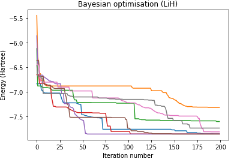

# simple-variational-quantum-eigensolver
A simple variational eigensolver implemented using ProjectQ and Bayesian optimisation.

## Description
A set of python scripts for implementing a simple variational eigensolver [].
Requires a text file specifying the Hamiltonian to use as input.
Also requires an Ansatz circuit object to be defined.

Includes examples for finding the ground state energy of LiH and H2.

Bayesian optimisation and the SPSA optimisation algorithm are available for optimisation.

## Requirements
projectq - for quantum simulation

GPyOpt - for Bayesian optimisation

`pip install projectq, gpyopt`
